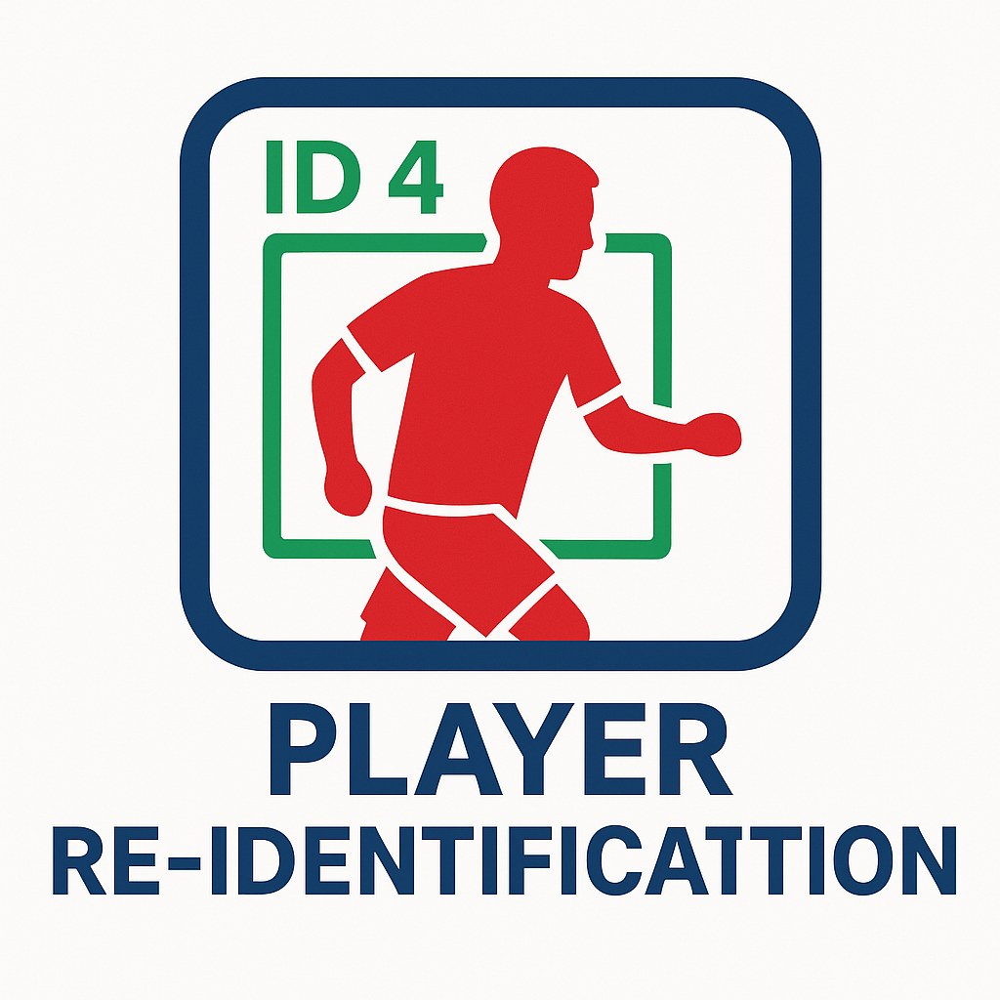
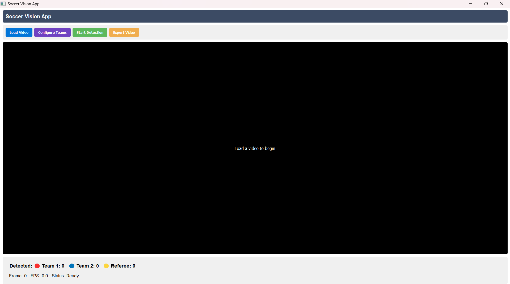

# ⚽ Soccer Vision Analyzer - Player Detection and Team Classification



**Assignment: Player Re-Identification in Sports Footage**  
**Submitted by:** Chaitanya Sharma  
**Task Chosen:** Option 2 - Re-Identification in a Single Feed  
**Submission:** PyQt5 GUI-based working prototype + documented insights

---

## 🎯 Objective

To identify and label players in a soccer video such that those exiting and re-entering the frame retain the same ID. This involves player detection, tracking, and appearance-based Re-ID.

---

## ✅ What I Completed

- 🔍 Used the provided YOLOv11 model (`best.pt`) to detect players and referees.
- 🎨 Classified team color (Red/Blue) using dominant color inside bounding boxes.
- 🖼️ Built a PyQt5-based desktop GUI to load and process videos with real-time detection overlay.
- ⚡ CUDA GPU support for smooth real-time inference.
- 🖋️ Custom overlay including bounding boxes, player type, team color, and a transparent logo watermark.

---

## 📌 Key Features

| Feature                  | Description                                                                 |
|--------------------------|-----------------------------------------------------------------------------|
| Real-time Detection      | Uses YOLOv11 for fast inference on soccer videos.                           |
| Team Classification      | Identifies team (Red/Blue) via color dominance inside bounding boxes.       |
| PyQt5 GUI                | Simple and functional GUI to load/start video processing.                   |
| Logo Overlay             | Custom logo watermark added to each frame.                                 |
| Lightweight + Fast       | Runs with <300ms/frame using GPU.                                           |

---

## 🤔 Why Re-ID Was Not Fully Integrated

While attempting to implement full Re-Identification (ReID), I explored multiple approaches:

- ✅ Tried using DeepSORT – struggled with identity switching and false continuity due to occlusion and re-entry.
- ✅ Evaluated SportsReID (OSNet-based appearance matching) – needed heavy preprocessing + large feature memory.
- ❌ YOLOv11 lacks native ID assignment; requires a robust ReID head or external embedding extractor.
- ❌ Visual appearance changes due to camera angle, lighting, and motion blur made reliable matching difficult.

---

## 🧠 My Learnings and Thoughts

- Re-ID in sports footage is a **non-trivial task** that demands:
  - A dedicated **appearance feature encoder** (e.g., OSNet, ResNet50-ReID).
  - Handling of occlusions, pose variation, and low-res crops.
  - Temporal reasoning or 3D pose tracking in ideal cases.
- **Color-based team classification** is a simple but effective visual enhancement.
- PyQt5 with OpenCV and CUDA is a great stack for building performant visual tools.

---

## 📂 Repository Structure

```
├── main.py                # PyQt5 GUI main script
├── utils/
│   └── color_utils.py     # Team color classification logic
├── data/
│   ├── best.pt            # YOLOv11 model (provided)
│   ├── logo.png           # Transparent watermark logo
│   └── 15sec_input_720p.mp4   # Input video
├── output/
│   └── results.mp4        # Output rendered video
├── screenshot.png         # Screenshot of the GUI
├── README.md              # Project explanation and findings
```

---

## 🎥 Demo

- ▶️ [Click to watch output video](output/results.mp4)
- 🖼️ Screenshot:



---
---

## 📹 More Examples

Here’s another example of the detection and team classification in action:

- ▶️ [Click to watch second video](data/2.mp4)

This video showcases the model's ability to detect and visually tag players with bounding boxes and team color classification.


## 🧩 Future Improvements

- Integrate appearance-based Re-ID using **SportsReID + cosine similarity**.
- Maintain a player feature memory and match new detections against it.
- Use keypoint estimation to further aid in identity tracking.
- Add export options (CSV logs, GIF clips, etc).

---

> ⚠️ Note: This is an iterative prototype with room for expansion. The current version focuses on detection + visualization with initial steps towards team-based classification and lays groundwork for further Re-ID development.
